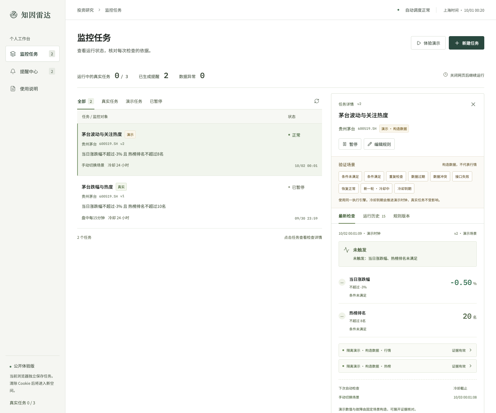

# 知因雷达

同花顺 AI 笔试第一题「可配置投资监控与风险雷达」。把一句关注点变成可核对的规则，持续检查，并说明为什么提醒、没有提醒或暂时无法判断。

**在线产品：[zhiyin-risk-radar.dimyoung-0719.workers.dev](https://zhiyin-risk-radar.dimyoung-0719.workers.dev)**

**源代码：[DimYoung-lab/zhiyin-risk-radar](https://github.com/DimYoung-lab/zhiyin-risk-radar)**



## 面向谁，解决什么问题

面向有明确关注对象、需要持续跟踪 A 股的个人投资研究者。比如「贵州茅台跌幅达到 3%，并进入热榜前 10 时提醒我」。用户需要知道关注点有没有发生，也需要分清条件未满足与数据不可用，避免重复查看行情和重复收到提醒。

产品围绕一个完整流程展开：**描述意图 → 核对并修改规则 → 预检真实数据 → 确认启用 → 后台检查 → 提醒与证据 → 编辑或暂停**。AI 帮助表达规则，用户保留确认权；触发结果来自可重复执行的比较逻辑。

## 三分钟体验

1. 点击「新建任务」，输入上述示例，生成草稿。核对跌幅是 `≤ -3%`，热榜是 `≤ 10 名`，并检查证券、频率和冷却期。
2. 点击「预检当前数据」查看真实扶摇数据和判断依据，再确认启用。选择任务，执行「立即检查」，展开证据查看来源、源时间、采集时间、单位、请求 ID 和原字段。
3. 点击「新建演示」，建立明确标记为构造数据的隔离任务。依次切换「条件满足」「重复检查」「数据过期」「接口失败」「恢复正常」「新一轮 · 冷却中」「冷却到期」，观察提醒、状态和历史的变化。场景使用固定构造值，修改规则后以实际比较结果为准。
4. 编辑规则并保存为新版本，在「规则版本」查看旧规则；在「提醒中心」回到产生提醒的具体检查记录。
5. 不再需要的任务可在详情中删除。确认后停止检查并永久清理关联的历史、版本和提醒，释放任务额度；需要保留记录时使用暂停。

当前浏览器拥有独立的匿名空间。网页关闭后，真实任务由服务器继续检查；演示任务只接受手动场景，不参与真实调度。

## 核心设计

| 需求 | 实现与取舍 |
|---|---|
| 可修改的统一规则 | 一个 A 股证券，1–6 个条件；价格、当日涨跌幅、过去 24 小时热榜排名、指定日期、是否交易日；AND / OR 组合 |
| 调度 | Workers 每分钟 Cron 扫描 D1 到期任务；上海时区盘中每 5 / 15 / 60 分钟、收盘后 15:10、每天指定时间 |
| 状态与恢复 | 等待检查、正常、数据异常及每次运行原因；失败后按 1 / 5 / 15 分钟退避；恢复后记录恢复并保留触发周期 |
| 去重与冷却 | 同一轮持续满足只提醒一次；可靠的“不满足”结束该轮；未知不结束；新一轮仍受原冷却截止时间限制 |
| 版本与并发 | 不可变规则版本，过期编辑返回 409；D1 租约与版本、令牌校验阻止旧执行写回；提醒、运行和状态在同一事务提交 |
| 任务清理 | 详情中二次确认删除，同空间权限校验；关联历史、版本和提醒级联清理，在途检查不能复活任务；满额提示区分暂停和删除 |
| 证据与异常 | 真实值回到接口、单位、时点和原字段；缺失、过期、冲突、失败为 unknown，不能替换为 0；AND / OR 使用三值逻辑 |
| 体验 | 任务表显示状态和计划，详情展示检查、证据、历史与版本；手机布局、键盘焦点、文字对比度和减弱动画偏好 |

盘中和收盘任务在执行时确认当天交易日。下一次时间仅表示检查计划，不预先假设未来日期开市。漏掉的历史检查不会被补造成真实触发。提醒目前只存储在应用内。

更多说明见 [交付与视频说明](docs/DELIVERY.md)、[设计说明](docs/DESIGN.md)、[测试与复现](docs/TESTING.md)、[AI 使用与验证记录](docs/AI_USAGE.md)。最终产品评审与 plan 验收记录见 [AUDIT.md](docs/AUDIT.md)。

## AI 的角色

开发过程中使用 Codex 完成方案、编码、测试、界面调整和交付整理。运行时后端调用 **DeepSeek Flash (`deepseek-flash`)** 的文字接口生成 JSON 草稿；不使用多模态。证券代码由真实证券检索确认，草稿再经服务端 Schema 校验，模糊阈值要求澄清，未支持的需求明确提示。

AI **不参与周期性判断、不自动启用任务、不生成实时数字、不执行交易**。模型不可用时可手动配置；已启用任务继续由规则引擎运行。成功解析记录保存模型名、输入哈希、验证状态和 token 用量，可通过当前空间的 `/api/ai-audit` 查询；未保存完整模型对话。

## 数据使用与口径

金融数据来自用户授权的 [扶摇 REST](https://fuyao.aicubes.cn/llms.txt)，密钥仅在 Worker 服务端使用。未使用 iFinD MCP，也未在生产失败时偷换成演示数据。

| 数据 | 实际接口与主要口径 |
|---|---|
| 证券消歧 | `/api/meta/tickers/search`，限定 A 股，使用 `thscode`、`name` |
| 行情 | `/api/a-share/prices/snapshot`，`last_price` 为元，`price_change_ratio_pct` 的 3 表示 3%；用 `prev_price` 验证涨跌幅，差异超过 0.05 个百分点标记冲突 |
| 热榜 | `/api/a-share/special-data/hot-stock-list?period=day`，过去 24 小时热度、仅前 30 名；完整榜单缺失标的只证明未进入前 30，具体名次未知 |
| 交易日 | `/api/a-share/calendar/trading-days`，近一年至当日；不声称掌握未来节假日 |

行情源时间是**快照就绪时间**，不能等同于该股票最后成交时间。盘中行情窗口 10 分钟；收盘后要求同日 15:00 以后的快照且不超过 12 小时；热榜窗口 60 分钟。跨日数据不能当作当前证据。数字展示保留两位小数，比较使用原始数值，展开原字段可核对。

## 验证

已完成规则引擎、客户端错误处理和金融 / 模型适配器的 **46 项自动测试**，以及实际 Worker / D1 上的 **33 项端到端 API 验证**，最终均通过。后台调度另用真实金融数据进行独立验收：创建定时任务后客户端进程退出，稍后读取 `kind=cron` 的持久化记录。

具体执行时间、结果、验证范围及复现命令见 [TESTING.md](docs/TESTING.md)。提交包附运行报告和实际产品录屏，演示中的异常与冷却数据明确标注为构造场景。

## 本地运行

推荐使用本项目专用 Conda 环境。它只安装 Node.js 24 与 npm，本目录 `node_modules` 与其他项目隔离，不修改已有 Python 环境。

```bash
conda env create -f environment.yml
conda activate zhiyin-risk-radar
npm ci
cp .env.example .dev.vars
```

在 `.dev.vars` 中填写自己的 `FUYAO_API_KEY`、`LLM_API_KEY` 和随机 `SESSION_SECRET`。密钥文件已被 Git 忽略。模型地址与名称配置在 `wrangler.jsonc`，默认使用 DeepSeek 原生接口。

```bash
npm run types
npm run db:local
npm run build
npm run dev:api
```

打开 `http://127.0.0.1:8787`，页面和 API 同源。无金融 / 模型凭证也能体验隔离演示与引擎测试；真实取数和文字解析需要相应凭证。

开发界面热更新可同时运行 `npm run dev`，Vite 将 `/api` 代理给 8787。仅改前端后，用 `npm run build` 更新 Worker 的静态页面。

```bash
npm run verify           # 测试、TypeScript 与生产构建
npm run test:integration # 本地 Worker 已运行且真实凭证已配置时执行
npm run check:docs       # 检查文档中的本地链接
```

## 部署到自己的 Cloudflare

使用自己的账号登录 Wrangler，创建 D1，将 `wrangler.jsonc` 的账号 / 数据库配置改为自己的值。公开代码中的数据库 ID 不是访问凭证；访问由 Cloudflare 账号权限控制。

```bash
npx wrangler login
npx wrangler d1 create zhiyin-risk-radar
npm run db:remote
npx wrangler secret put FUYAO_API_KEY
npx wrangler secret put LLM_API_KEY
npx wrangler secret put SESSION_SECRET
npm run deploy
```

部署包含静态页面、API、D1 绑定和每分钟 Cron。Cron 不依赖浏览器在线。UI 显示心跳新鲜度，但不承诺实时或固定秒级执行。

## 已知边界与未做事项

- 当前覆盖 A 股单证券的价格、涨跌幅、热榜和日历组合。公告 / 新闻事件、指数、基金、财务、估值、均线、成交量、多证券联动尚未接入；模型不能把这些悄悄改写成已支持条件。
- 当前是有限额的公开体验版：每个空间最多 3 个运行中的真实任务、30 个总任务；全站最多 12 个真实任务；AI 每空间每日 20 次、全站每日 200 次。Cron 每轮最多取 4 个到期任务，繁忙时会延后。
- 匿名 Cookie 空间不支持登录、跨设备同步或找回。清除 Cookie 失去当前空间入口，服务器上的真实任务仍可能继续；请在清除前暂停或删除。已支持用户主动删除，但尚无自动清理策略、回收站及长期存储保留政策。
- 仅应用内提醒，未做邮件、短信或推送，也没有交易连接。不存在股票涨跌预测、买卖和仓位建议或收益保证。
- 未做多来源交叉核验、完整事件溯源平台、长时间压力测试或交易日连续运行验证。公开链接的可用性取决于 Cloudflare、模型和金融数据服务；数据不可用时展示原因并退避，不伪装为正常未触发。
- 数据接口的成功不代表具备全部数据再分发授权。当前按候选人提供的凭证完成题目体验，不公开凭证和批量原始行情数据；商业上线前需确认服务商授权范围。
