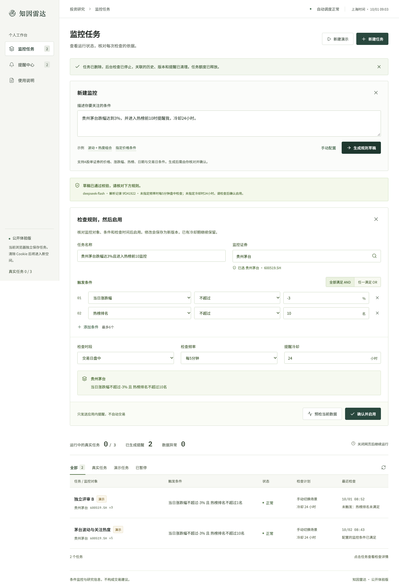
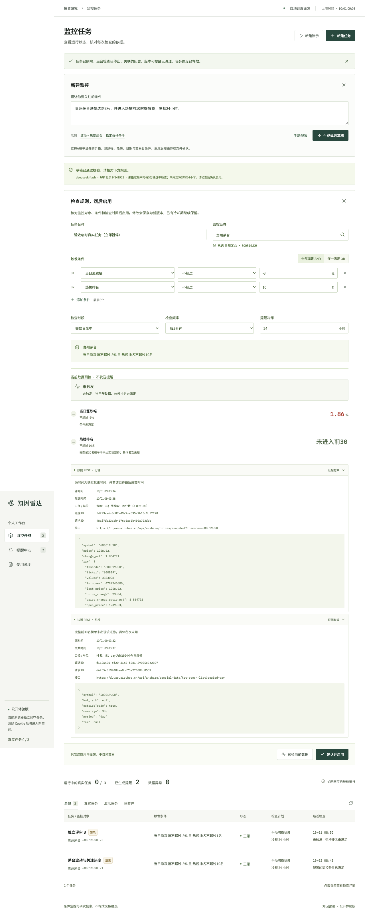
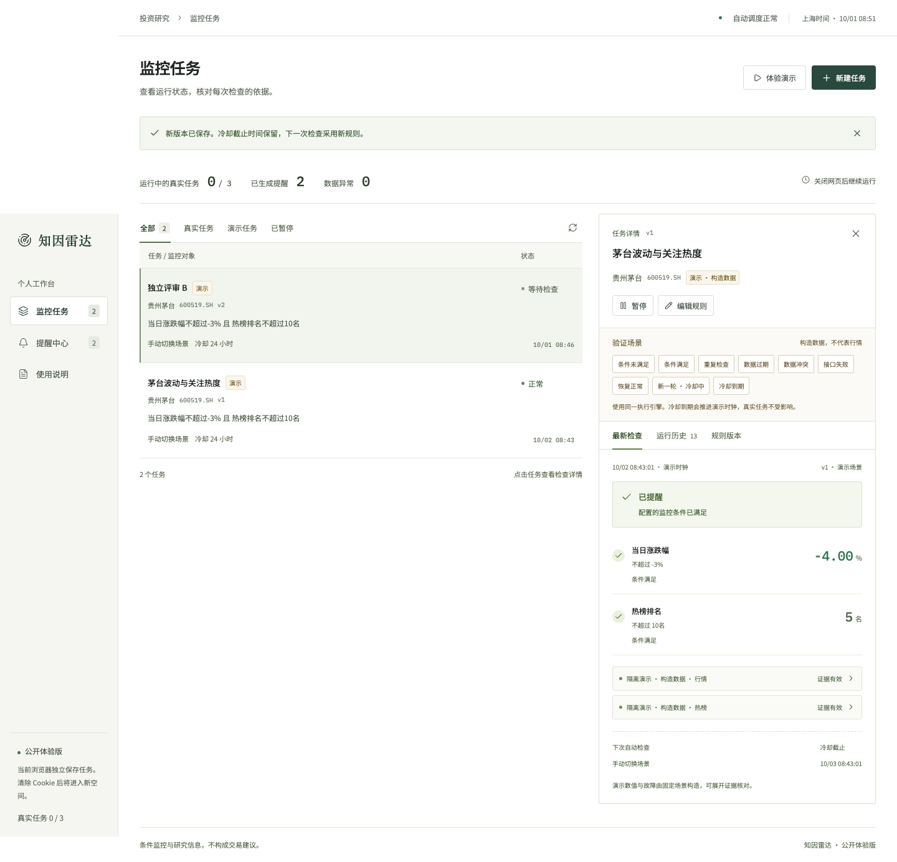
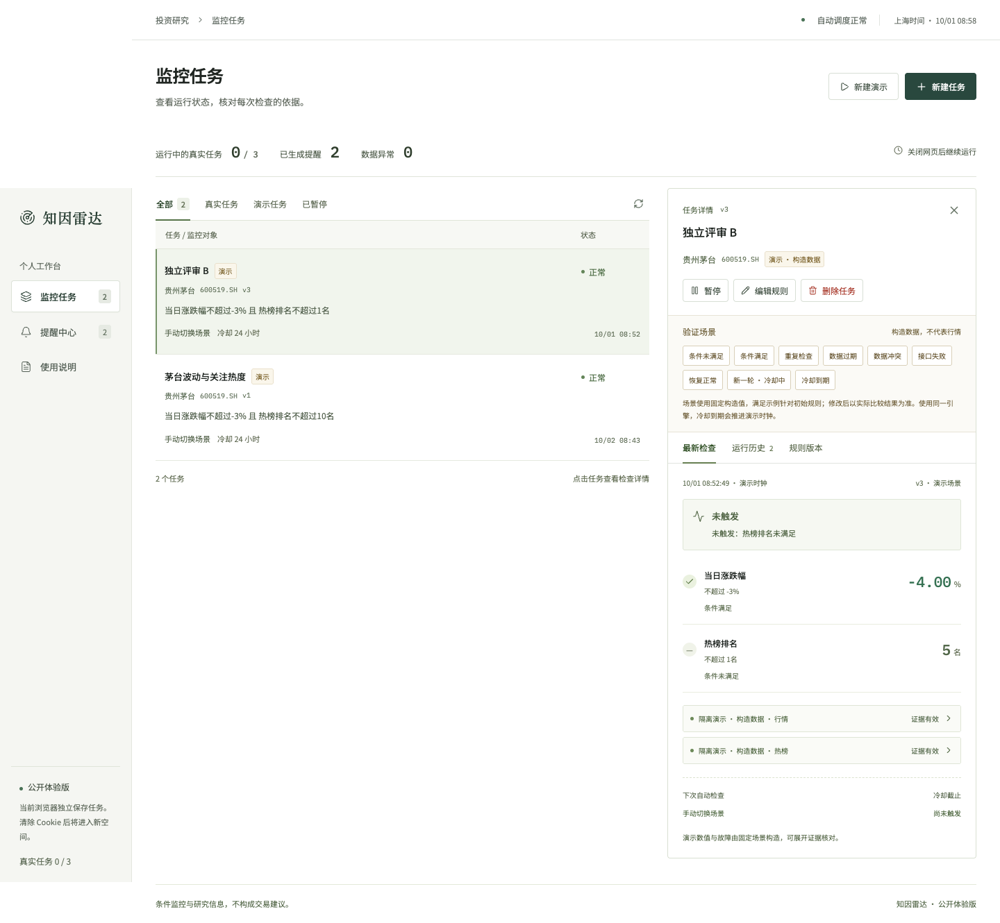
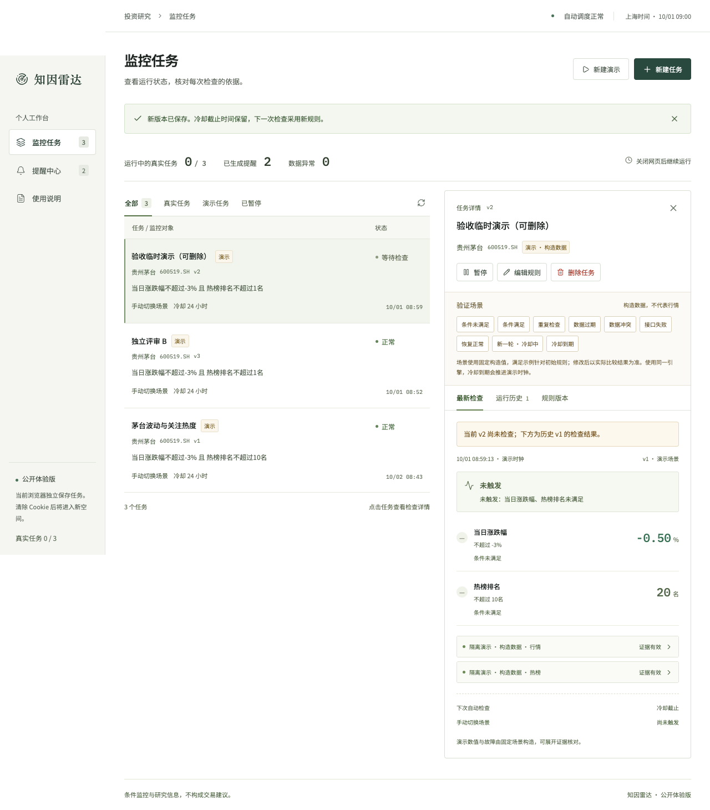
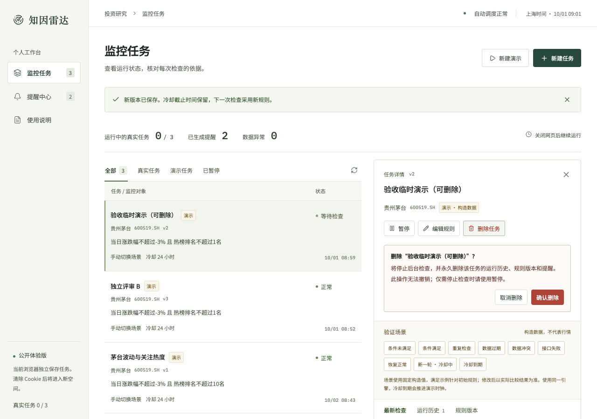
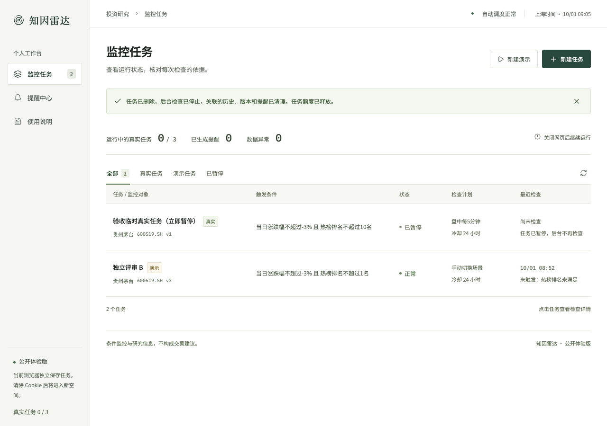

# 最终验收与独立产品评审

验收日期：2026-10-01。对象：[知因雷达线上产品](https://zhiyin-risk-radar.dimyoung-0719.workers.dev)、实际题目附件及 [PLAN.md](PLAN.md)。

**结论：当前作品覆盖第一题的四项提交要求与已接受计划，必要的产品缺口已修复。独立 AI 产品裁判评分为 92 / 100，无仍阻断提交的 P0 / P1 问题。** 这是内部产品评审，不是同花顺官方成绩或生产稳定性承诺。

本文保留首轮产品裁判的原评分和当时的观察。用户追加的体验评审随后复现四项问题，现已修复并完成本地、线上回归，见 [UX_REVIEW.md](UX_REVIEW.md)。未保存编辑的原缺口也已补齐；本轮不修改历史评分。

## 评审方法与评分

独立 `product_judge` Agent 只读审查源码、题目和计划，使用自己的浏览器与匿名空间操作线上产品。它实际核验创建、规则修改、数据预检、状态、异常、恢复、冷却、历史、提醒追溯和删除，并在修复部署后重复原复现步骤。主 Agent 负责修复、完整自动 / API 测试、后台调度与交付包核验。

| 维度 | 权重 | 得分 | 依据与保留余量 |
|---|---:|---:|---|
| 核心主链路与任务建模 | 30 | 28 | 文本解析、编辑、真实预检、确认启用成立；价格、涨跌幅、热榜、日期、交易日统一支持 AND / OR |
| 长期执行与任务管理 | 25 | 24 | 调度、状态、去重、冷却、恢复、版本、暂停及删除成立；未验证长期交易日连续运行 |
| 数据判断与可追溯性 | 20 | 19 | 值、单位、源时间、取数时间、请求 ID、原字段可核对；依赖单一数据源及其快照时间 |
| 用户习惯与交互 | 15 | 13 | 首轮评分时新建、详情、版本警示与任务清理成立；未保存编辑缺口已在后续用户视角评审修复，保留原分数 |
| 交付与验证 | 10 | 8 | 文档、AI 记录和测试说明充分；评分时最终包、视频与仓库同步仍待主 Agent 收尾 |
| 合计 | 100 | **92** | 保留独立裁判原评分，不因主 Agent 后续收尾自行加分 |

独立裁判额外执行了 1 次真实模型解析和 1 次真实金融预检：得到跌幅 `≤ -3%`、热榜 `≤ 10 名`、AND、冷却 24 小时；完整 Top30 未出现标的时，没有编造第 31 名。其真实测试任务在启用后 13 秒内暂停；结束时全部测试任务与提醒已清理，未操作用户空间。

## 题目与计划逐项验收

| 原题要求 | 当前结果 | 可核对证据 |
|---|---|---|
| 1. 可运行主链路，自然语言转可检查、可修改规则，统一任务模型 | 满足 | 实际 DeepSeek 草稿、证券消歧、编辑与预检、确认启用；Schema 和确定性三值引擎；视频与真实模型记录 |
| 2. 调度、状态、去重、冷却、恢复、版本；过期、冲突、失败解释 | 满足 | 实际 Cron 记录、D1 持久化、运行历史、原版本提醒；真实 API 检查与同引擎隔离异常场景 |
| 3. 可操作 Web URL、源码仓库、README 所需内容 | 满足 | [线上产品](https://zhiyin-risk-radar.dimyoung-0719.workers.dev)、[公开仓库](https://github.com/DimYoung-lab/zhiyin-risk-radar)、[README](../README.md) 的用户 / 设计 / AI / 数据 / 边界 |
| 4. 60–180 秒视频、AI 使用与验证、主链路 / 异常 / 合规测试及数字追溯 | 满足 | 168 秒实际录屏；[AI_USAGE.md](AI_USAGE.md)、[TESTING.md](TESTING.md)、包内运行报告、原字段证据及文件校验清单 |

原题写的是“价格、事件、日历、热度**或**组合条件”。已接受计划选择价格、热度、日历及组合；未接入公告事件已披露，无需为本题临时扩展事件引擎。附件写 48 小时，执行以用户提供的平台 24 小时倒计时为准。

[PLAN.md](PLAN.md) 的环境、Git、接口、主链路、规则模型、后台运行、异常测试、UI、文档、视频与提交包均有对应产物。最终提交包的具体 Git 版本、部署版本、168 秒视频信息和 SHA-256 见 `delivery-manifest.json`。

## 用户流程验收

| 顺序 | 用户动作 | 实际判断 |
|---:|---|---|
| 1 | 进入工作台，选择新建或演示 | 入口明确，匿名空间和演示构造数据有说明 |
| 2 | 描述关注点、生成草稿、核对证券与条件 | AI 解析后仍需用户确认；单位、比较方向、频率和冷却可编辑 |
| 3 | 预检真实数据，再启用 | 预检不发提醒；证据说明快照时间与榜外证券，未知不伪装成未触发 |
| 4 | 返回任务表、切换任务、查看详情 | 创建后进入全部任务与最新检查；延迟旧响应不会替换当前任务 |
| 5 | 检查满足、重复、异常、恢复与冷却 | 提醒、去重和恢复可观察；固定演示值在修改规则后按实际比较解释 |
| 6 | 编辑版本、查看历史、从提醒返回检查 | 新版本未运行时明确警示旧结果；旧提醒指向原版本具体检查 |
| 7 | 暂停或恢复 | 暂停保留记录与冷却；恢复检查当前数据，不补造暂停期间触发 |
| 8 | 删除不再需要的任务 | 明确永久清理，取消保留、确认释放额度；关联提醒随任务清理 |

本次浏览器检查覆盖桌面及 390px 手机布局；没有将短期浏览器核验写成完整无障碍认证、数周稳定性测试或生产 SLA。

## 只修复必要问题

判定标准是可复现的错误目标、无法完成任务管理或可能误读执行结果。以下五项有实际复现，并已在部署后复核。

| 优先级 | 原问题与用户影响 | 修复与复核结果 |
|---|---|---|
| P1 | 没有删除入口；演示和暂停任务累计达到 30 后无法释放总额度，满额提示暂停也无效 | 增加删除确认、同空间权限与关联记录级联清理；在途执行不能复活任务；区分总额度与运行额度。取消保留、确认清理、满额后删除可新建均通过 |
| P1 | A 请求晚返回覆盖已选 B 的详情，可能编辑或暂停错任务 | 对选择请求和刷新序列加目标校验；把 A 的真实 GET 延迟 30 秒再选 B，旧响应到达后仍显示 B v3 |
| P2 | 筛选后新建演示在列表中不可见，详情继承旧历史页 | 新建后切到全部任务与最新检查；筛选空态可回到全部，入口明确叫“新建演示” |
| P2 | 新版本尚未检查，却展示旧结果，版本关系不醒目 | 明确提示“当前 v2 尚未检查；下方为历史 v1 的检查结果”，避免当作新规则结论 |
| P2 | 改阈值后“条件满足”固定场景可能不满足，容易误认为引擎错判 | 补充固定构造值说明；引擎按新规则实际比较，不引入动态造数来强行满足 |

同时修正验证计数：Vitest 只扫描 `tests/**/*.test.ts`，避免把提交目录的源码副本重复算作测试。最终自动测试是 **46 项**；新增六项实际 API 验收后，本地和线上分别是 **33 项**。

### 本轮截图证据

以下为本次实际浏览器操作截图，构造场景均有演示标记。

## 收尾验证与保留边界

主 Agent 已完成 46 / 46 项源测试、TypeScript / Vite 构建、本地与线上各 33 / 33 项 API 检查。最终部署再次在客户端退出后执行真实 Cron，上海时间 08:59:13 开始、08:59:16.897 完成，运行 ID `8560161e-ab7c-4594-965a-99f18b3b9181`。报告见 `verification/cron-latest-proof.json`，完整范围见 [TESTING.md](TESTING.md)。

收尾还包括 README / 忽略规则同步、文档交叉引用、168 秒视频、包内版本与报告一致性、压缩包完整性和凭证排除；具体交付方式见 [DELIVERY.md](DELIVERY.md)。机器报告和截图是证据，评分不替代验证。

本轮没有增加登录同步、邮件推送、回收站、批量管理、图表或更多数据类型。它们可能对正式产品有价值，但不解决此次已复现的核心问题，也不是当前计划的必要验收项。

匿名 Cookie 丢失后可能无法重新管理旧任务；仅应用内提醒；尚无自动保留策略、多来源核对或长期连续运行证明。这些边界已在 README 披露，不能把首版验收写成正式投资服务的承诺。
