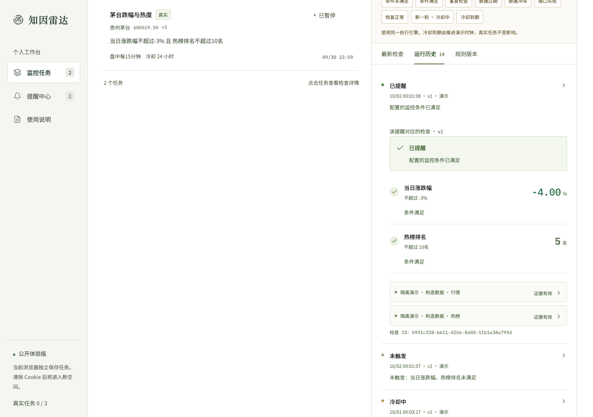
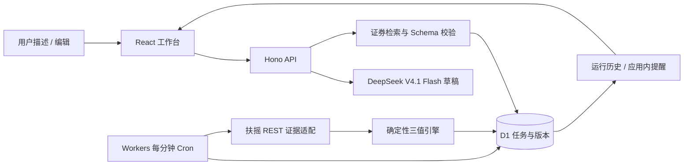

# 产品与实现说明

## 核心场景

投资研究者已经有关注对象，需要把「某项条件发生时再看」交给持续运行的服务。知因雷达优先完成可解释的条件监控：提醒成立必须有可核对证据，没有提醒必须区分条件未满足、冷却、重复、检查时段与数据不可用。

首版选择单证券的价格 / 热度组合，同时支持日历。它能覆盖规则表达、两类数据、组合判断、持续执行和异常恢复，避免把题目扩展成研究报告系统。这里的“风险”指用户设定条件的变化，不是产品对资产风险程度的预测。

## 使用流程与界面

工作台采用固定导航、紧凑任务表和右侧检查详情。首页直接展示任务和状态；新建区按需展开，减少介绍性大卡片。监控对象、条件、状态、计划和最近检查放在同一行，适合反复查看。

新建流程保留明确的确认步骤。草稿编辑器展示证券、字段、比较方式、数值和单位，旁边可预检实际数据。启用后可以立即检查、暂停、恢复或编辑；提醒链接回对应运行记录，旧规则始终留在版本列表。

删除需要再次确认，停止调度并永久清理任务及关联的历史、版本和提醒；暂停用于保留记录。新建成功后回到全部任务和最新检查，避免被旧筛选隐藏。切换任务时，旧请求不能覆盖当前详情；新版本尚未运行时，旧版结果会显示醒目提示。演示使用固定构造值，规则变化后不承诺“满足示例”仍满足新条件。

使用 frontend-design 和 UI UX Pro Max 的设计原则调整视觉：中文任务语境、暖白底、深绿操作色、细分隔线、窄圆角、数字等宽；去掉装饰性英文、巨型标语和光效。状态同时用文字与颜色；支持清晰键盘焦点、跳至主内容链接、移动布局和减弱动画偏好。

规则确有改动时，关闭或替换编辑器先确认是否放弃，默认继续编辑，Escape保留草稿。确认框沿用既有视觉样式和原生对话框焦点约束；刷新或离开浏览器页面时请求浏览器的原生离开提示，不承诺在所有浏览器关闭情形下都能拦截。无改动无需确认。

预检只对应发起时的规则。修改任一规则字段后立即清除结果、废弃在途响应并提示重新预检；解析也使用请求序列，在取消、替换或修改输入后忽略旧结果。保存失败在编辑器提交区域解释并移入焦点，草稿保留供修正。复现与线上回归见 [用户视角评审](UX_REVIEW.md)。

提醒会直接展开对应的旧检查，不会拿当前规则版本替换当时的证据。单条记录查询与任务列表使用同一空间权限。

## 系统边界

模型只位于创建草稿的支路。已启用任务的执行不再调用模型。输入文本和模型结果都不授予工具执行权；金融接口固定在服务端白名单路径，凭证不下发前端。

## 统一任务模型

`Rule` 包括证券、原始文字、条件数组、AND / OR、检查计划和冷却分钟数。当前条件字段为 `price`、`change_pct`、`hot_rank`、`date`、`trading_day`。同一规则由预检、手动检查、Cron 和演示执行共享。

`Task` 保存当前版本、启停、下一次运行时间、上次条件状态、触发轮次、已提醒轮次、冷却截止、失败次数及租约。`Version` 保存不可变规则。`Run` 保存使用的版本、运行类型、开始 / 完成时间、判断、逐条件证据和数据质量。`Alert` 关联具体运行与版本。

## 触发、去重和冷却

| 当前证据 | 对持续状态的影响 | 是否提醒 |
|---|---|---|
| 首次可靠满足 | 开始一轮，记录该轮已提醒与冷却截止 | 是 |
| 同一轮持续满足 | 保留轮次 | 否，标记去重 |
| 可靠不满足 | 结束当前满足状态 | 否 |
| 缺失 / 过期 / 冲突 / 失败 | 保留上次可靠条件状态 | 不以未知生成提醒 |
| 新一轮满足但冷却未结束 | 开始新轮，等待冷却截止 | 否 |
| 冷却截止后仍满足 | 该轮首次提醒 | 是 |

条件组合使用 Kleene 三值逻辑：AND 存在可靠 false 即可确定 false；OR 存在可靠 true 即可确定 true。其他必要证据不足时保持 unknown。即使组合已可确定，也单独保留局部数据异常的健康状态和逐条件解释。

暂停保留已有轮次和冷却；恢复只检查当前数据。编辑会重置条件轮次、增加版本，同时保留原冷却截止，防止通过修改规则绕过冷却。旧版本在途结果不写回新版本，不生成提醒。

## 调度和并发

后台每分钟读取最多 4 个到期真实任务。每个执行通过 D1 条件更新取得 90 秒租约，并在取得租约后重新读最新持续状态。提交时同时检查版本与租约令牌；运行、提醒和状态用 D1 batch 事务写入。

Cron 运行按任务、版本、分钟槽位去重。失去执行权的记录标记作废；租约过期后的下一次执行说明之前被中断。系统不假造暂停或中断期间的历史结果。

盘中窗口为上海时间 09:30–11:30、13:00–15:00，收盘检查为 15:10。执行时取当天交易日历，休市跳过；日历失败则暂停该次判断。失败按 1、5、15 分钟退避，恢复会记入结果。跳过检查不会清除已有故障计数。

## 证据质量

每份金融证据保存接口、源时间、采集时间、请求 ID、单位、标准字段与相关原字段。行情执行的完成时间使用真实采集后的时钟；演示使用明确标注的场景时钟。

源时间缺失、跨日、过老和未来异常时间均不能当作新鲜证据。行情的价格与前收盘价推算涨跌幅差异超过 0.05 个百分点即冲突。热榜只提供 Top30，完整榜单外的证券没有虚构“第 31 名”；榜单不完整则无法判断。

错误只给出可理解的状态和重试说明，不展示上游响应正文或凭证。真实任务不接受场景注入。演示 fixture 使用与真实任务相同的执行引擎和持久化路径，但有不同任务模式、明确数据标签和独立时钟。

## 公开体验的范围

用签名 HttpOnly、SameSite Strict Cookie 区分浏览器空间，写请求要求同源 JSON。全站和空间配额控制模型与真实任务用量。删除按空间限制，D1 外键级联清理；运行开始和提交均核验任务及租约，删除后在途执行无法重新插入提醒。这里不把匿名体验当作完整账户系统：还需登录、数据保留、消息渠道和长期运行治理，具体边界见 README。

每空间最多3个运行中的真实任务、全站12个，是公开体验的保守运营配额。真实任务会在浏览器关闭后持续调用金融接口并写入D1；限制单空间占用，有助于多个体验空间共享每轮最多4个检查的Cron调度。3不是模型限制、笔试规定或压测确定的承载上限。暂停释放运行额度，演示不参与真实调度，30个总任务额度另外计算。启用监控之后不再调用模型，不能把运行任务配额归因于模型token限制。
