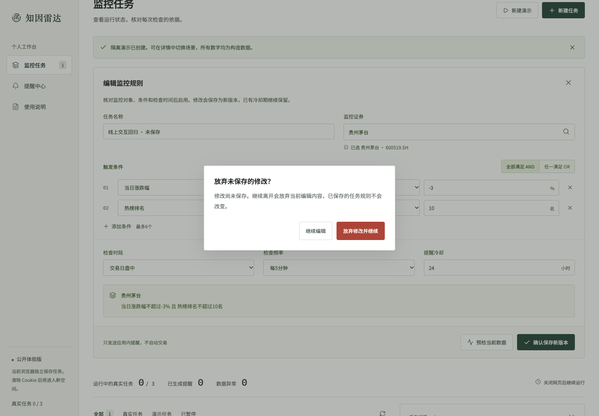
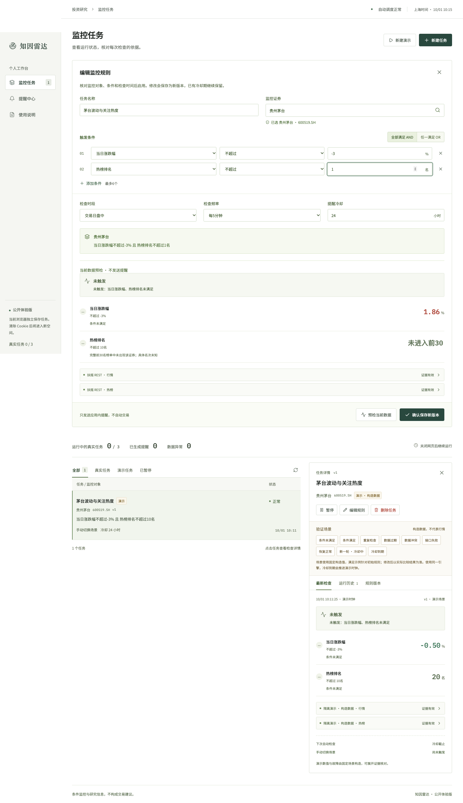
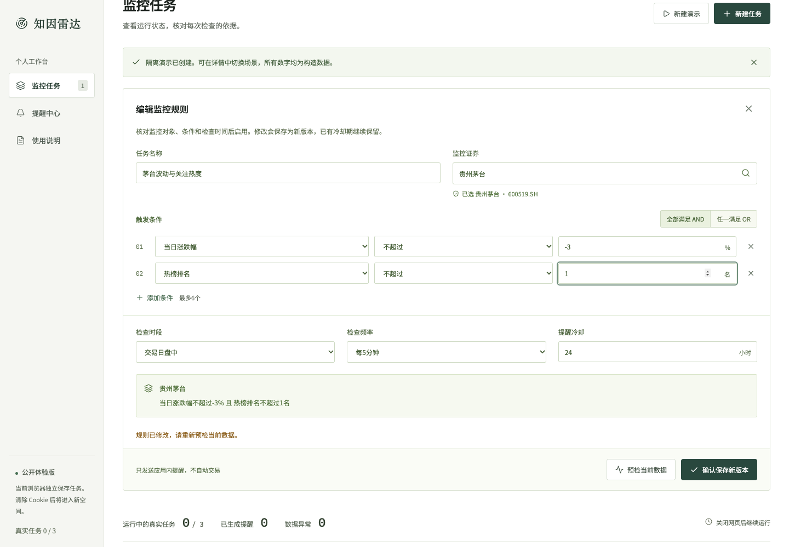
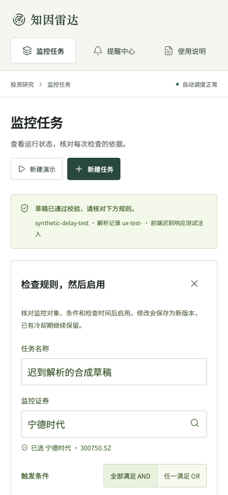
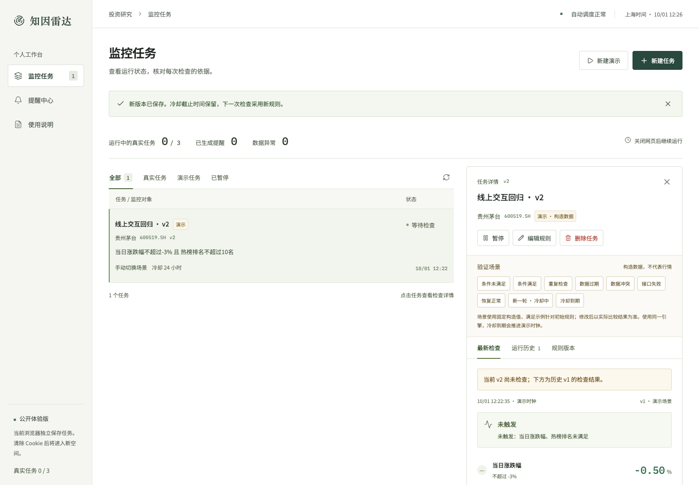
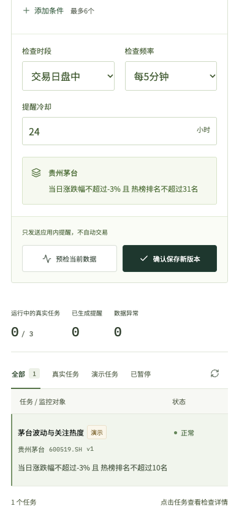
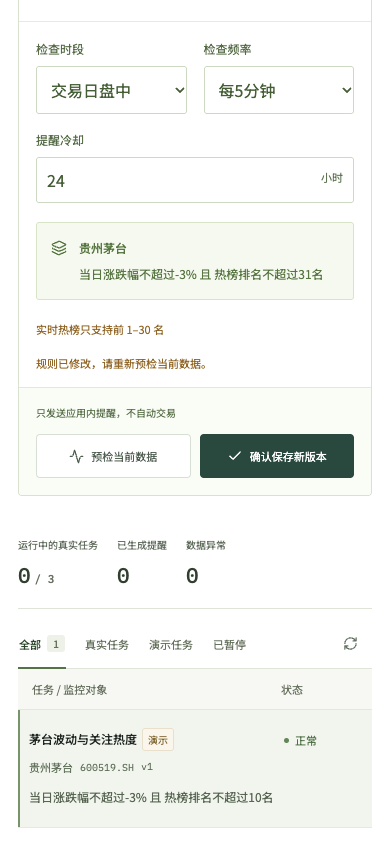
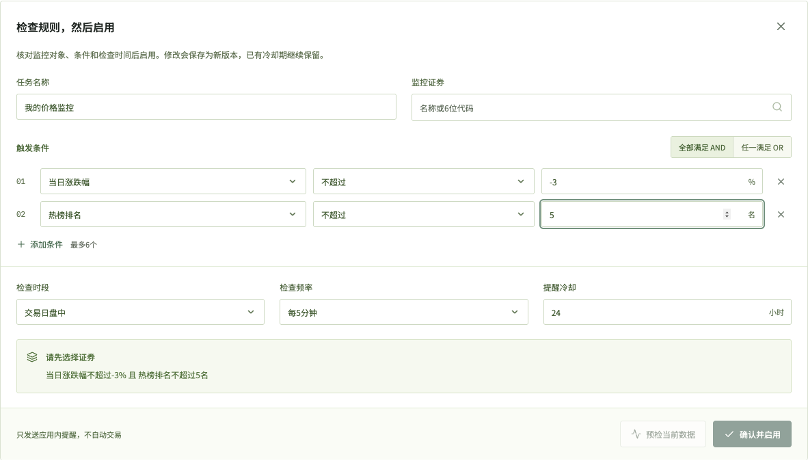
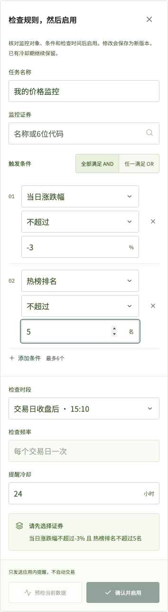

# 用户视角补充评审

评审日期：2026-10-01。范围为用户从新建、核对规则到保存、管理和追溯提醒的实际操作，遵循 [PLAN.md](PLAN.md) 与第一题原附件。独立 `user_experience_judge` Agent 复现了四项真实问题，主 Agent 已完成修复、部署和线上回归。

**结论：四项问题均已修复；主链路与题目要求保持成立，沿用当前工作台的视觉风格。** 首轮产品裁判的 92 / 100 保留为历史评审分数，见 [AUDIT.md](AUDIT.md)；本轮没有据此自行加分，也不代表官方考试成绩。

## 需求筛选

只纳入能复现、会丢失操作成果、误导判断或阻碍用户完成任务的问题。每项均有具体触发步骤与修复后复核。

| 优先级 | 实际问题与复现 | 用户影响 | 必要修改与结果 |
|---|---|---|---|
| P2 | 编辑任务名称或阈值后，关闭编辑器、切换任务或进入其他页面，修改直接消失 | 用户以为修改仍保留，或必须重新输入 | 仅在规则确有改动时确认离开；默认焦点为“继续编辑”，Escape 保留草稿，明确放弃后再执行原动作。无改动直接关闭 |
| P1 | 对热榜 ≤10 的规则发起预检，响应返回前改为 ≤1；旧响应随后出现在新规则下方 | 用户可能将旧条件的结果当作新规则判断 | 规则变更立即清除预检、废弃在途响应，并提示重新预检；检查请求序列和规则内容均对应当前编辑状态 |
| P2 | 生成草稿期间关闭新建区域，迟到的解析结果重新打开编辑器 | 已取消的操作打断后续任务，可能覆盖新草稿 | 关闭、替换草稿或修改输入时废弃旧解析结果；旧成功或失败不再改变当前页面 |
| P2 | 390×844 手机布局中输入热榜31并保存，错误只显示在已滚出屏幕的页首 | 用户看不到失败原因，容易重复点击或误以为保存成功 | 将保存错误显示在编辑器提交区域并移入焦点；保留草稿，修正后可正常保存新版本 |

本轮未加入强制预检才能启用、每次暂停都确认、登录同步、推送、回收站、批量任务或更多图表。它们不是本轮已复现问题的必要解决办法。预检仍是辅助核对，启用仍由用户明确确认；暂停可逆且保留记录，删除已有永久清理确认。

## 实际复核与证据

独立 Agent 完成四项原问题复现与本地修复回归，还核验了保存v2、暂停恢复、触发和提醒追溯。它在线上补充复核时触及账户用量限制，因此本轮四项线上复核由主 Agent 完成；不将这部分标为独立 Agent 的线上验收。

原问题复现包含一次真实模型解析与一次真实金融预检。为稳定控制迟到顺序，解析取消与修复回归使用明确标记的合成合法响应。主 Agent 在线上分别延迟预检和解析响应5秒，仅验证页面是否接纳旧结果，没有用合成响应证明模型或金融服务的效果。真实主链路的模型、金融与后台调度证据另见 [TESTING.md](TESTING.md)。

| 线上操作 | 实际结果 |
|---|---|
| 修改名称后关闭、点击同一任务、新建任务、新建演示、进入使用说明 | 均出现放弃确认；取消后名称保留，未多建任务或修改数据库 |
| 对话框默认焦点、Tab 和 Escape | 默认“继续编辑”，Tab 到放弃按钮，Escape 返回草稿；没有改动时不弹框 |
| 预检≤10，响应延迟5秒，改为≤1后等待返回 | 旧预检不显示，保留重新预检说明 |
| 解析延迟5秒，关闭新建后等待返回 | 新建区、规则编辑器和解析信息均未重新出现 |
| 手机热榜31保存失败 | “实时热榜只支持前1–30名”在可见区域，顶部319px，焦点移入错误；数据库仍为v1且阈值10 |
| 修正为10并保存 | 成功成为v2，草稿关闭，显示新版本说明 |
| 暂停、恢复、条件满足、重复检查 | 暂停时场景不可执行；恢复后按v2运行；连续满足只有1条提醒 |
| 提醒回到检查、删除取消与确认 | 展开原v2检查及匹配的完整运行ID；取消保留，确认后主 Agent 测试空间任务与提醒均为0 |

两个 Agent 均使用各自的 Playwright 匿名空间，没有修改用户空间；测试任务已清理。内置浏览器仅用于只读查看，因为它共享用户的匿名空间，当前工具未提供独立上下文入口。

机器结果见提交包 `verification/ux-review-report.json`。报告记录部署版本、实际加载的前端资源、四项结果、合成响应范围与清理状态。测试工具最初的 URL 构造器不可用、误用不存在的提醒接口等执行错误已在测试脚本中纠正后再核验，没有因此修改产品API。无效阈值的预期HTTP400也没有被计为产品崩溃。

### 界面证据

新增确认框复用既有文字、边框、圆角和按钮样式；错误使用既有行内反馈，不另建视觉体系。桌面与手机截图已实际查看。

## 题目与计划约束

本轮只改前端编辑与异步反馈，没有改变规则引擎、服务端校验、金融口径、D1、调度、去重、冷却、恢复和版本机制。价格、热度、日历及组合仍共用统一规则，用户仍须核对并确认启用，数据异常仍按原规则解释。

README、设计、AI记录、测试说明与交付材料已同步。本轮反馈交互有截图与回归报告；旧168秒视频保留作参考，用户将重新录制最终提交视频。完整四项题目验收与新版视频待完成状态见 [AUDIT.md](AUDIT.md)，文件与包说明见 [DELIVERY.md](DELIVERY.md)。

前端修复后重新运行自动测试，46/46通过，TypeScript与生产构建通过。现有本地/线上各33项API报告与真实Cron记录保留为未修改后端的先前证据，本轮不把它们写成重新执行。有限浏览器回归不是完整无障碍认证或长期运行保证；忽略迟到结果也不表示上游模型请求已取消计费。

## 后续表单细节复核（主 Agent）

用户指出下拉箭头过于靠右后，主 Agent 复核了实际控件和手机布局。沿用现有字体、绿色、边框、圆角和按钮样式；以下修改均有具体显示问题，未重新评分。

| 实际问题 | 修改与复核 |
|---|---|
| 系统原生下拉箭头靠近右边缘，各控件无法精确统一位置 | 使用同一14px箭头图形，距右边缘12px，文字右侧预留38px；仍是原生select，保留标签和焦点样式。高对比度模式恢复系统原生箭头 |
| 条件行给删除按钮留28px，但按钮最小宽32px | 统一为32px，按钮右边缘与条件行对齐，不再超出栅格 |
| 手机样式把带单位输入框的右边距覆盖成10px，单位也未垂直居中 | 为数值保留46px，单位垂直居中且不截获点击；日期不预留空单位，保留原生日期输入 |
| 选择交易日收盘后，禁用的频率框仍显示每5分钟 | 显示“每个交易日一次”；切回盘中后原频率保留。只纠正显示，未改变后台调度 |
| 手机收盘时段的文字被双列挤掉；调整箭头后窄条件列也需要足够文字空间 | 480px及以下检查计划使用单列；420px及以下条件字段、比较和值纵向排列。360px和390px的选中项全文可见，无横向溢出 |

使用说明、README和AI使用记录区分 **DeepSeek V4.1 Flash** 实际版本与 `deepseek-flash` 调用别名，并引用官方说明。体验上限的原因也已说明：每空间3个运行中的真实任务是控制持续取数和共享调度负载的保守运营选择，不是笔试规定、模型限制或压测确定的性能上限；暂停释放运行名额，演示不占运行名额。

主 Agent 在本地及新线上部署各完成8项检查，包含桌面对齐、原生控件焦点、时段切换、日期与交易日、360px/390px、高对比度以及使用说明。机器记录见提交包 `verification/ui-detail-review.json`；没有创建持久化任务，测试空间的任务和提醒均为0。构建与部署预检通过；本轮只调整前端，47项自动测试、33项API及真实Cron报告保留各自此前时间，未声称重新执行。

键盘范围仅验证Tab/Shift+Tab顺序与可见焦点；选项变化使用Playwright的原生selectOption。macOS无头Chrome中ArrowDown/Enter在修改前后均未改变选项，属于此次自动验证的限制，不据此修改产品，也不冒称已验证所有键盘选择方式。

