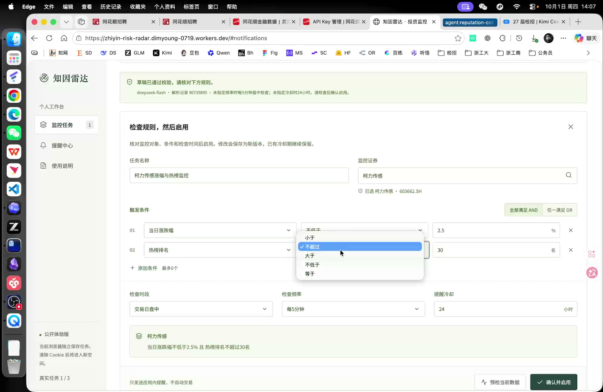
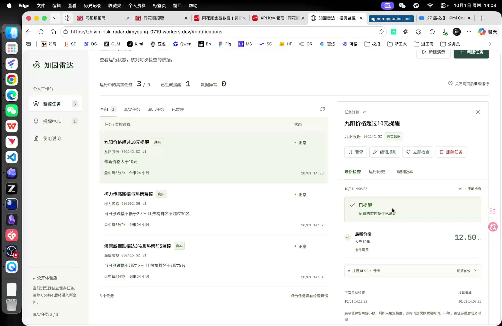
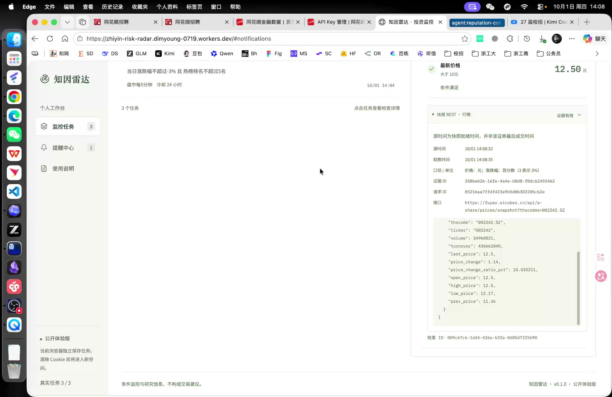

# 最终演示视频导览与核对

核对日期：2026-10-01。产品版本v0.1.0。最终提交文件为目录根部的`演示视频.mp4`，由用户实际操作线上产品录制。原文件保留，不剪辑、不重编码。

- 时长：**100.899秒（约1分41秒）**，满足题目的60–180秒要求。
- 画面：1920 × 1248，30fps，H.264 / MP4；文件11,462,231字节。
- 音轨：AAC双声道；音量检测接近静音，主要通过页面文字说明操作与结果。
- 视频SHA-256：`7fe5b37cf8c0097888f3fab99f30a3ac16043e797d49ca433e65b53c3685b314`。

## 关键画面

以下是实际成片中的时间定位，便于评审快速核对，不是另一次功能执行。

| 视频位置 | 可见内容 | 对应能力 |
|---|---|---|
| 00:24 | 输入“柯力传感涨幅达到2.5%，并进入热榜前30时提醒我，冷却24小时”，生成规则草稿 | 自然语言关注点、涨跌幅与热度组合 |
| 00:31 | 已校验草稿；603662.SH、涨跌幅不低于2.5%、热榜不超过30名、AND、盘中每5分钟、冷却24小时；下拉控件展开 | 可检查、可修改规则，明确单位、比较方向与默认计划 |
| 00:38 | “监控已启用，后台会按配置调度”，任务详情和运行历史 | 用户确认启用、任务状态与检查入口 |
| 00:47 | 真实检查的源时间、取数时间、单位、证据ID、请求ID、接口与原始行情字段；榜外证券没有编造名次 | 未触发原因、金融数据口径和数字追溯 |
| 01:05、01:13 | 输入“九阳价格超过10元时提醒我，每5分钟检查一次”，生成价格条件并确认启用 | 单证券价格条件与文字解析的第二个实例 |
| 01:19 | 九阳股份002242.SZ显示12.50元、“已提醒”、手动检查、下一次自动检查与冷却截止 | 真实条件满足、提醒原因、后续计划及冷却状态 |
| 01:25 | 展开九阳行情证据；原字段`last_price: 12.5`与展示一致，显示完整检查ID | 提醒对应的原始数据和检查可核对 |
| 01:28、01:32 | 提醒中心保存规则v1、触发原因与检查记录 | 应用内提醒与原版本检查关联 |
| 01:37 | 使用说明中的调度、去重、冷却、退避、版本、暂停恢复与产品边界 | 用户能够理解运行规则与首版限制 |

画面中的12.50元属于录制当次检查的历史快照，不代表评审时当前价格；它来自证券行情接口，不能当作模型生成的数字。视频中的提醒标记为手动检查，不将它写成浏览器关闭后的Cron执行证明。后台运行有独立实际记录，见[TESTING.md](TESTING.md)。

## 视频范围与其他验证材料

核对采用ffprobe元数据、每10秒概览，以及24、31、38、47、65、73、76、79、82、85、88、92、97秒的原尺寸关键帧；不是逐帧鉴定或额外的真实金融接口复测。

本段成片重点展示真实文字解析、规则检查与编辑入口、任务启用、检查解释、真实提醒和证据追溯。**没有完整操作展示**去重、异常恢复、冷却到期、新版本切换、暂停恢复或删除流程。这些能力有此前真实执行的测试与截图，不把它们声称为已在本视频中逐项演示。

如需体验上述能力，打开[线上产品](https://zhiyin-risk-radar.dimyoung-0719.workers.dev)，点“新建演示”，按[RECORDING_GUIDE.md](RECORDING_GUIDE.md)的场景步骤核对；构造场景有明确标签，不与真实行情混淆。实现、报告与证据分别见[DESIGN.md](DESIGN.md)、[TESTING.md](TESTING.md)、[AUDIT.md](AUDIT.md)和[UX_REVIEW.md](UX_REVIEW.md)。

题目要求提交60–180秒演示视频及覆盖主链路、数据/接口异常和合规边界的测试说明；视频与测试材料共同提供证据。技术与内容核对不能代替官方评分，也不证明长期稳定性。文件哈希、源码Git版本和各报告实际执行时间见提交目录的`delivery-manifest.json`。
